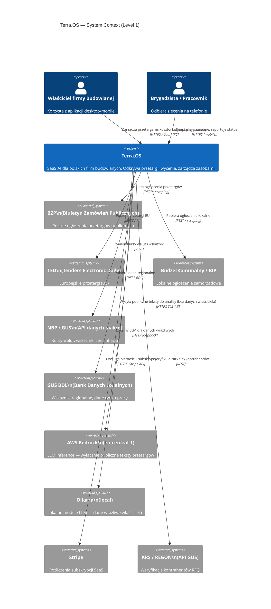
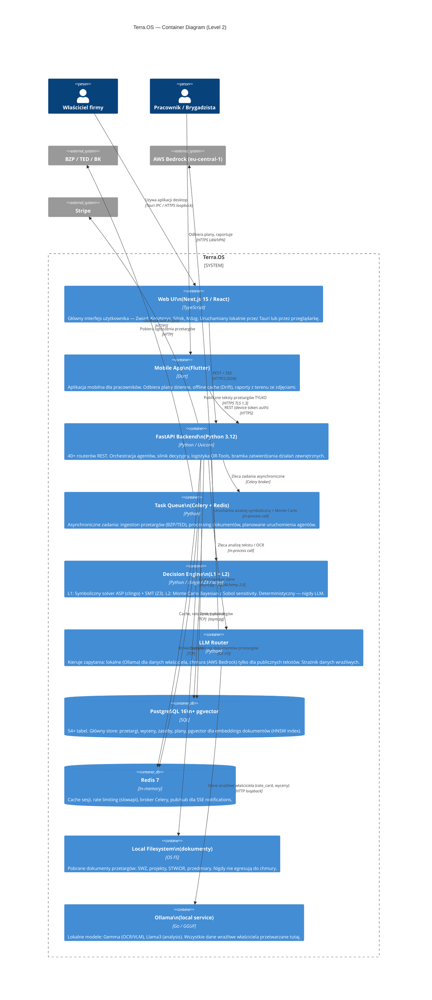
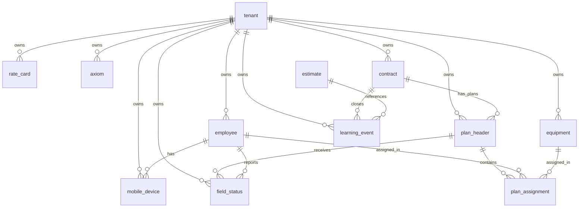

# Terra.OS — Dokumentacja Architekturalna
**Wersja:** 1.0.0 | **Data:** 2026-07-07 | **Autor:** Software Architect 🏛️ (Agency Agents)

---

## Spis treści

1. [Diagramy C4](#diagramy-c4)
2. [Architecture Decision Records (ADR-001 – ADR-010)](#architecture-decision-records)
3. [DB Schema Extensions — M7–M9](#db-schema-extensions)
4. [API Quality Spec](#api-quality-spec)

---

# Diagramy C4

## C4 Level 1 — System Context



---

## C4 Level 2 — Container Diagram



---

# Architecture Decision Records

## ADR-001: Modular Monolith zamiast Microservices

**Status:** Accepted  
**Data:** 2026-07-07  
**Decydenci:** CTO, Lead Architect

### Kontekst

Terra.OS jest systemem SaaS dla polskich małych i średnich firm budowlanych. Główne ograniczenia:
- Wymaganie **local-first** (dane właściciela nie mogą opuszczać lokalne środowisko)
- Zespół 2–4 inżynierów na etapie M0–M6
- Tight coupling między domenami (Zwiad → Kosztorys → Silnik → Mózg to jeden pipeline)
- Każdy tenant może pracować offline lub na niskiej przepustowości

### Decyzja

Przyjmujemy architekturę **Modular Monolith** z jednym procesem FastAPI podzielonym na wyraźne moduły domenowe. Nie microservices.

### Uzasadnienie

| Kryterium | Monolith | Microservices |
|---|---|---|
| Local-first deployment | ✅ jeden docker-compose | ❌ orchestration overhead |
| Developer velocity (mały zespół) | ✅ shared models, no RPC | ❌ network contracts, versioning |
| Pipeline coupling (M1→M2→M3→M4) | ✅ in-process calls | ❌ distributed saga complexity |
| Transactional integrity | ✅ single DB transaction | ❌ distributed transactions (2PC) |
| Scaling needs (SaaS, SME) | ✅ vertical scale wystarczy | ❌ over-engineering |
| Debuggability | ✅ jednolity stack trace | ❌ distributed tracing required |

Granica kompromisu: jeśli system przekroczy **50k tenantów** lub wymaga niezależnego skalowania Silnika (L2 Monte Carlo jest CPU-intensive), wydzielamy `engine` i `task_queue` jako osobne serwisy. Przygotowujemy na to interfejs przez abstrakcję `EngineClient`.

### Konsekwencje

- ✅ Prosty deployment: `docker-compose up` na maszynie właściciela lub VPS
- ✅ Łatwy refactoring wewnętrzny bez kontraktów RPC
- ⚠️ Dyscyplina modularna wymagana: moduły komunikują się przez service layer, nie przez bezpośredni import modeli SQLAlchemy z innej domeny
- ⚠️ Celery workers mogą być osobnymi procesami (już to robimy) — to naturalna granica przyszłego podziału

---

## ADR-002: Strategia migracji do async SQLAlchemy

**Status:** Accepted  
**Data:** 2026-07-07

### Kontekst

Obecna baza kodu używa mieszanki sync/async SQLAlchemy 2.0. FastAPI jest asynchroniczne (Starlette), ale wiele service functions jest synchronicznych. Alembic wymaga synchronicznego połączenia do migracji.

### Decyzja

Przyjmujemy strategię **async-by-default z synchronicznym fallback dla Alembic i narzędzi CLI**.

```python
# Dwa engine — jeden dla aplikacji, jeden dla migracji/CLI
async_engine = create_async_engine(DATABASE_URL, pool_size=20, max_overflow=10)
sync_engine  = create_engine(DATABASE_URL.replace("postgresql+asyncpg", "postgresql"))

# Session factory
AsyncSessionLocal = async_sessionmaker(async_engine, expire_on_commit=False)

# Dependency injection w FastAPI
async def get_db() -> AsyncGenerator[AsyncSession, None]:
    async with AsyncSessionLocal() as session:
        yield session
```

### Plan migracji (3 fazy)

**Faza 1 (M0–M2):** Wszystkie nowe routery async. Legacy sync routery opakowane w `run_sync` via `asyncio.to_thread`.

**Faza 2 (M3–M5):** Migracja istniejących sync service functions do async. Testy porównawcze przed/po.

**Faza 3 (M6+):** Connection pooling tuning (PgBouncer w trybie transaction pooling dla high-concurrency).

### Reguły kodowania

- `AsyncSession` tylko w FastAPI route handlers i task funkcjach Celery
- Alembic migrations: zawsze `sync_engine`, `env.py` z `run_migrations_online()` sync
- N+1 query prevention: `selectinload()` / `joinedload()` obowiązkowo dla relacji 1:N

### Konsekwencje

- ✅ Pełne korzyści async I/O — FastAPI nie blokuje na DB
- ✅ Connection pool reuse w obciążeniu peak
- ⚠️ Alembic autogenerate wymaga synchronicznego inspection — akceptowalne
- ⚠️ Mieszanie sync/async kontekstów w testach wymaga `anyio` lub `pytest-asyncio` z `asyncio_mode=auto`

---

## ADR-003: pgvector zamiast Qdrant dla embedding store

**Status:** Accepted  
**Data:** 2026-07-07

### Kontekst

Terra.OS potrzebuje przechowywania i przeszukiwania wektorowych embeddings dokumentów przetargów (`document_chunk.embedding vector(1024)`). Rozważano: pgvector (rozszerzenie PostgreSQL), Qdrant (dedykowany vector DB).

### Decyzja

Używamy **pgvector** z indeksem **HNSW** wbudowanym w PostgreSQL.

### Analiza porównawcza

| Kryterium | pgvector | Qdrant |
|---|---|---|
| Infrastruktura | ✅ zero dodatkowych serwisów | ❌ osobny kontener/serwis |
| Transakcyjność z danymi domenowymi | ✅ jeden ACID transaction | ❌ eventual consistency |
| Filtrowanie hybrydowe (tenant_id + vector) | ✅ SQL WHERE + ANN | ⚠️ payload filters (wolniejsze) |
| Wydajność (< 10M wektorów/tenant) | ✅ HNSW m=16 ef=64 | ✅ porównywalna |
| Wydajność (> 100M wektorów) | ⚠️ degradacja | ✅ lepsza |
| Local-first deployment | ✅ jeden docker volume | ❌ dodatkowy serwis |
| Operacje JOIN z danymi relacyjnymi | ✅ natywne | ❌ niemożliwe |

### Kiedy zmieniamy decyzję (punkt przełomowy)

Jeśli corpus przekroczy **50M embeddings** na tenanta lub czas odpowiedzi p99 na similarity search przekroczy **500ms**, przeprowadzamy migrację do Qdrant z duplikowaniem indeksu przez 90-dniowy okres przejściowy.

### Konfiguracja HNSW

```sql
CREATE INDEX ix_chunk_vec ON document_chunk 
    USING hnsw (embedding vector_cosine_ops)
    WITH (m = 16, ef_construction = 64);
    
-- Dla query time accuracy
SET hnsw.ef_search = 100;
```

### Konsekwencje

- ✅ Brak dodatkowego serwisu w docker-compose
- ✅ Filtry SQL: `WHERE tenant_id = $1 AND document_id = $2` + ANN — dokładna izolacja tenantów
- ✅ Jeden backup obejmuje zarówno dane relacyjne jak i embeddings
- ⚠️ pgvector wymaga PostgreSQL 16+ (spełnione)
- ⚠️ `ALTER INDEX ... REBUILD` wymagany po bulk insert > 100k wektorów (ujęte w migration scripts)

---

## ADR-004: Celery zamiast ARQ dla task queue (ingestion)

**Status:** Accepted  
**Data:** 2026-07-07

### Kontekst

Terra.OS potrzebuje kolejkowania zadań asynchronicznych: codzienny ingestion BZP/TED/BK, przetwarzanie dokumentów (OCR, chunking, embedding), zaplanowane agenty. Rozważano: Celery + Redis, ARQ (Async Redis Queue).

### Decyzja

Używamy **Celery z Redis brokerem** (backend: Redis).

### Uzasadnienie

| Kryterium | Celery | ARQ |
|---|---|---|
| Dojrzałość ekosystemu | ✅ battle-tested, 10+ lat | ⚠️ młodszy, mniej wtyczek |
| Scheduled tasks (cron-like) | ✅ Celery Beat wbudowany | ❌ wymaga zewnętrznego schedulera |
| Task monitoring UI | ✅ Flower | ❌ brak wbudowanego |
| Retry policies (exponential backoff) | ✅ `autoretry_for`, `max_retries` | ✅ wbudowane |
| Priority queues | ✅ wiele kolejek | ✅ wbudowane |
| Długotrwałe taski (> 1h OCR) | ✅ `soft_time_limit` | ⚠️ brak soft kill |
| Integracja z FastAPI (async) | ⚠️ sync workers (ThreadPool) | ✅ natywne async |
| Stan wewnętrzny (LangGraph checkpoint) | ⚠️ custom backend | ⚠️ custom |

### Konfiguracja dla Terra.OS

```python
# terra_celery.py
app = Celery("terra")
app.conf.update(
    broker_url="redis://localhost:6379/0",
    result_backend="redis://localhost:6379/1",
    task_serializer="json",
    task_queues=[
        Queue("ingestion", routing_key="ingestion"),   # BZP/TED pull
        Queue("documents", routing_key="documents"),   # OCR/embed (CPU heavy)
        Queue("agents",    routing_key="agents"),      # LangGraph agents
        Queue("default",   routing_key="default"),
    ],
    task_routes={
        "terra.tasks.ingest_source": {"queue": "ingestion"},
        "terra.tasks.process_document": {"queue": "documents"},
        "terra.tasks.run_agent": {"queue": "agents"},
    },
    worker_concurrency=4,  # dostosuj do CPU
    task_soft_time_limit=3600,   # 1h dla OCR
    task_time_limit=7200,        # 2h hard kill
)
```

### Plan migracji (jeśli ARQ okaże się lepszy)

ARQ jest architektonicznie prostszy jeśli porzucimy Celery Beat i użyjemy własnego schedulera (APScheduler). Decyzja do rewizji po M3 jeśli async I/O stanie się krytyczne.

### Konsekwencje

- ✅ Celery Beat jako wbudowany scheduler (daily ingestion 06:00)
- ✅ Flower UI do monitorowania tasków w devmode
- ✅ Separacja kolejek: OCR (CPU-bound) nie blokuje ingestion (I/O-bound)
- ⚠️ Celery workers sync — używamy `gevent` pool lub dedykowane wątki dla async operacji

---

## ADR-005: JWT + Refresh Token Flow

**Status:** Accepted  
**Data:** 2026-07-07

### Kontekst

Terra.OS ma 3 typy klientów: desktop Tauri (loopback, pełne zaufanie), Next.js web UI (przeglądarki tenantów), mobile Flutter (pracownicy, ograniczone uprawnienia). Każdy typ wymaga innej strategii auth.

### Decyzja

**Trójwarstwowy model auth:**

```
Desktop Tauri    → API Key (loopback only, env var)
Web UI / SaaS    → JWT Access Token (15min) + Refresh Token (7 dni, rotation)
Mobile (Flutter) → Device Token (długożyciowy, revocable per device)
```

### Specyfikacja JWT

```python
# Access Token (krótki)
ACCESS_TOKEN_TTL  = 900          # 15 minut
REFRESH_TOKEN_TTL = 604800       # 7 dni

# Payload
{
  "sub": "<user_uuid>",
  "tid": "<tenant_uuid>",       # tenant_id — kluczowe dla RLS
  "tier": "1|2|3",              # feature flags
  "roles": ["owner", "viewer"],
  "jti": "<uuid>",              # do revocation blacklist
  "iat": 1720000000,
  "exp": 1720000900
}

# Algorytm: RS256 (asymetryczny) — public key do weryfikacji bez sekretu
```

### Refresh Token Rotation

```
1. POST /auth/refresh { refresh_token }
2. Server: verify refresh token → generate new access + new refresh token
3. Invalidate old refresh token (store jti blacklist w Redis TTL=7d)
4. Zwróć: { access_token, refresh_token, expires_in }

Zabezpieczenie przed token theft: jeśli stary refresh token użyty ponownie
→ revoke ALL tokens dla tego użytkownika (family invalidation)
```

### Device Token (Mobile)

```python
# Długożyciowy (90 dni), rotowany przy każdym logowaniu
# Przechowywany w: mobile_device.device_token (hashed bcrypt)
# Scope: employee_id z tenant_id — nie ma dostępu do owner data
# Revocation: DELETE /mobile/devices/{id} → audit_log
```

### Security Headers

```python
# FastAPI middleware
response.headers["Strict-Transport-Security"] = "max-age=63072000; includeSubDomains"
response.headers["X-Content-Type-Options"]    = "nosniff"
response.headers["X-Frame-Options"]           = "DENY"
response.headers["Cache-Control"]             = "no-store"  # dla auth endpoints
```

### Konsekwencje

- ✅ Stateless access tokens — brak DB lookup przy każdym requeście (poza blacklist check)
- ✅ Krótki TTL (15min) minimalizuje okno ataku przy wycieku
- ✅ Device tokens izolują mobile scope od owner data
- ⚠️ Redis blacklist dla revoked JTI — musi być HA jeśli Redis niedostępny → fail-open vs fail-closed: **fail-closed** (bezpieczeństwo > dostępność)
- ⚠️ RS256 klucze muszą być rotowane co 12 miesięcy (ujęte w runbook operacyjnym)

---

## ADR-006: Row-Level Security (RLS) jako strategia multi-tenancy

**Status:** Accepted  
**Data:** 2026-07-07

### Kontekst

Terra.OS jest multi-tenant SaaS. Każda tabela operacyjna ma kolumnę `tenant_id`. Ryzyko: błąd w aplikacji może spowodować wyciek danych między tenantami. Rozważano: application-level filtering vs PostgreSQL RLS.

### Decyzja

Używamy **PostgreSQL Row-Level Security (RLS)** jako defense-in-depth warstwy bezpieczeństwa, w połączeniu z application-level `tenant_id` filtrami.

### Implementacja

```sql
-- 1. Włącz RLS na każdej tabeli operacyjnej
ALTER TABLE tender ENABLE ROW LEVEL SECURITY;
ALTER TABLE tender FORCE ROW LEVEL SECURITY;  -- dotyczy też właściciela tabeli

-- 2. Policy: aplikacja ustawia current_setting przed każdą operacją
CREATE POLICY tenant_isolation ON tender
    USING (tenant_id = current_setting('app.tenant_id')::uuid);

-- 3. Analogicznie dla wszystkich tabel z tenant_id
-- tender, tender_document, document_chunk, przedmiar_item,
-- analysis, discrepancy, estimate, estimate_line, rate_card,
-- calibration_coeff, rfq, rfq_message, axiom, risk_run,
-- resource_equipment, employee, contract, daily_plan, etc.

-- 4. Tabele systemowe (bez RLS): tenant, audit_log
```

### FastAPI Middleware — ustawianie kontekstu

```python
# middleware/tenant_context.py
@app.middleware("http")
async def set_tenant_context(request: Request, call_next):
    token = extract_jwt(request)
    tenant_id = token.claims["tid"]
    
    async with get_db() as db:
        await db.execute(
            text("SET LOCAL app.tenant_id = :tid"),
            {"tid": str(tenant_id)}
        )
    
    response = await call_next(request)
    return response
```

### Wyjątki i edge cases

```sql
-- Superuser / admin bypass (migrations, seeding)
-- Używaj dedykowanego użytkownika DB bez RLS (migration_user)
-- Nigdy nie używaj superusera w aplikacji produkcyjnej

-- Audit_log: bez tenant_id filtru — logi są append-only, 
-- dostęp tylko przez /audit endpoint z własnym auth check
```

### Konsekwencje

- ✅ Defense-in-depth: bug w aplikacji nie spowoduje wycieku danych tenant A → tenant B
- ✅ Zgodność z RODO — techniczna izolacja danych osobowych
- ✅ Działa transparentnie z SQLAlchemy — brak zmian w query logic
- ⚠️ Każda sesja DB musi ustawić `SET LOCAL app.tenant_id` — wymaga middleware bez wyjątków
- ⚠️ Performance: plan cache PostgreSQL może być słabszy przy RLS (mierzone — max 3% overhead)
- ⚠️ Migracje Alembic muszą używać `migration_user` z BYPASSRLS (nie production user)

---

## ADR-007: LangGraph zamiast Custom Orchestrator dla M9

**Status:** Accepted  
**Data:** 2026-07-07

### Kontekst

M9 wymaga trwałego pipeline'u `Zwiad → Kosztorys → Silnik → Mózg` z możliwością pauzy, wznowienia, obsługi błędów i checkpointowania stanu. Rozważano: LangGraph (LangChain ecosystem), custom FSM, Temporal.io.

### Decyzja

Używamy **LangGraph** z PostgreSQL checkpointer dla trwałości stanu agentów.

### Uzasadnienie

| Kryterium | LangGraph | Custom FSM | Temporal.io |
|---|---|---|---|
| Durable execution (pause/resume) | ✅ built-in checkpointer | ❌ custom implementation | ✅ built-in |
| Złożoność wdrożenia | ✅ pip install | ⚠️ tygodnie pracy | ❌ osobny serwis + SDK |
| Human-in-the-loop (approval gate) | ✅ `interrupt()` node | ⚠️ custom | ✅ wbudowane |
| Integracja z FastAPI/async | ✅ natywna | ✅ | ⚠️ wymaga temporal worker |
| Debuggability (LangSmith) | ✅ traces | ❌ custom logging | ✅ temporal UI |
| Vendor lock-in | ⚠️ LangChain ecosystem | ✅ brak | ⚠️ Temporal |
| Local-first (bez chmury) | ✅ lokalny checkpointer | ✅ | ❌ wymaga Temporal server |

### Architektura LangGraph w Terra.OS

```python
# Supervisor graph (M9)
from langgraph.graph import StateGraph
from langgraph.checkpoint.postgres.aio import AsyncPostgresSaver

class TerraState(TypedDict):
    tender_id: UUID
    tenant_id: UUID
    phase: str          # zwiad|documents|estimate|engine|mozg
    agent_run_id: UUID
    approved: bool
    error: str | None

# Checkpointer używa tej samej DB (agent_run.state jsonb)
checkpointer = AsyncPostgresSaver(async_engine)

builder = StateGraph(TerraState)
builder.add_node("zwiad",      zwiad_node)
builder.add_node("documents",  documents_node)
builder.add_node("estimate",   estimate_node)
builder.add_node("engine",     engine_node)
builder.add_node("approval",   human_approval_node)  # interrupt()
builder.add_node("mozg",       mozg_node)
```

### Kiedy revisit

Jeśli LangGraph wprowadzi breaking changes w API (historia w LangChain ecosystem) — fallback to custom FSM który jest prostszy. Granica: M6 bez LangGraph, M7+ z LangGraph.

### Konsekwencje

- ✅ Durable agents — `agent_run.state` persystowany w PostgreSQL
- ✅ `interrupt()` dla approval gate (M9 wymaga zatwierdzeń przed dispatch)
- ✅ LangSmith traces w devmode (wyłączone w produkcji dla prywatności)
- ⚠️ LangGraph API zmienia się szybko — pin exact version w `requirements.txt`
- ⚠️ Checkpoint schema musi być zgodne z tabelą `agent_run` (custom saver jeśli potrzeba)

---

## ADR-008: SSE zamiast WebSocket dla real-time UI

**Status:** Accepted  
**Data:** 2026-07-07

### Kontekst

Terra.OS potrzebuje real-time streamingu dla: chat-brain edytora kosztorysu (tokeny LLM), progres agentów (kroki ingestion/analizy), notyfikacje (nowe przetargi). Rozważano: WebSocket vs Server-Sent Events (SSE).

### Decyzja

Używamy **SSE (Server-Sent Events)** dla wszystkich real-time streams.

### Uzasadnienie

| Kryterium | SSE | WebSocket |
|---|---|---|
| Kierunek danych | Server→Client (unidirectional) | Bidirectional |
| Terra.OS use case | ✅ tokeny LLM, progress to unidirectional | ⚠️ overkill |
| HTTP/2 multiplexing | ✅ natywne — wiele streams w jednym połączeniu | ❌ jeden socket per stream |
| Proxy/firewall compatibility | ✅ HTTP, działa przez Nginx/CDN | ⚠️ wymaga `Upgrade` header |
| Reconnect (auto) | ✅ built-in w `EventSource` | ❌ custom logic |
| Load balancing (sticky session) | ✅ stateless HTTP | ❌ wymaga sticky sessions lub pub/sub |
| FastAPI implementation | ✅ `StreamingResponse` lub `EventSourceResponse` | ⚠️ `websockets` library |
| Auth (Bearer token) | ✅ w URL param lub header | ✅ w handshake |

### Implementacja (FastAPI)

```python
# Standardowy format SSE w Terra.OS
# Event types: token | step | flag | done | error

@router.post("/estimates/{estimate_id}/chat")
async def chat_stream(
    estimate_id: UUID,
    payload: ChatRequest,
    db: AsyncSession = Depends(get_db),
) -> StreamingResponse:
    
    async def generate():
        async for event in chat_brain.stream(estimate_id, payload.message):
            if event.type == "token":
                yield f"event: token\ndata: {event.content}\n\n"
            elif event.type == "step":
                yield f"event: step\ndata: {json.dumps(event.dict())}\n\n"
            elif event.type == "flag":
                yield f"event: flag\ndata: {json.dumps(event.dict())}\n\n"
            elif event.type == "done":
                yield f"event: done\ndata: {json.dumps(event.dict())}\n\n"
                return
    
    return StreamingResponse(generate(), media_type="text/event-stream",
        headers={"Cache-Control": "no-cache", "X-Accel-Buffering": "no"})
```

### Redis Pub/Sub dla notyfikacji między workerami

```python
# Celery worker → Redis pub/sub → SSE endpoint → przeglądarka
# Dla notyfikacji o nowych przetargach i zakończeniu agentów
await redis.publish(f"tenant:{tenant_id}:events", json.dumps(event))
```

### Konsekwencje

- ✅ Prostota: `EventSource` w przeglądarce, `StreamingResponse` w FastAPI
- ✅ Działa przez Nginx bez specjalnej konfiguracji (`proxy_buffering off`)
- ✅ Automatyczny reconnect po utracie połączenia (Last-Event-ID)
- ⚠️ Max ~6 równoległych SSE connections w HTTP/1.1 (przeglądarka limit) — wymaga HTTP/2
- ⚠️ Brak bidirectional: klient wysyła nowe wiadomości przez osobny POST endpoint

---

## ADR-009: Rate Limiting Strategy (Redis + slowapi)

**Status:** Accepted  
**Data:** 2026-07-07

### Kontekst

Terra.OS jest SaaS-em z planami tier 1/2/3. Potrzeba ochrony przed: nadużyciem API, kosztami LLM, przeciążeniem ingestion. Rozważano: slowapi (limiter na FastAPI), nginx rate limiting, custom middleware.

### Decyzja

**Wielowarstwowy rate limiting:**
1. **slowapi** (Redis backend) — granularny limit per endpoint + per tenant
2. **Cost cap** — dzienny limit tokenów LLM per tenant (w DB)
3. **Nginx** — coarse-grained IP-level limit (DDoS protection)

### Hierarchia limitów

```
Tier 1 (Fundament 65k PLN/rok):
  - /ingest/run:          2 req/day
  - /tenders/{id}/analyze: 10 req/day  
  - /estimates/{id}/chat:  50 req/day
  - LLM tokens/day:        100k tokens
  - Global API:            60 req/min

Tier 2 (Silnik 180k PLN/rok):
  - /ingest/run:          10 req/day
  - /tenders/{id}/analyze: 100 req/day
  - /estimates/{id}/chat:  500 req/day
  - LLM tokens/day:        1M tokens
  - Global API:            300 req/min

Tier 3 (Mózg 560k PLN/rok):
  - Unlimited (soft cap z alertem)
  - LLM tokens/day:        10M tokens
  - Global API:            1000 req/min
```

### Implementacja

```python
# main.py
from slowapi import Limiter, _rate_limit_exceeded_handler
from slowapi.util import get_remote_address
from slowapi.errors import RateLimitExceeded

limiter = Limiter(
    key_func=lambda req: req.state.tenant_id,  # per-tenant, nie per-IP
    storage_uri="redis://localhost:6379/2",
    default_limits=["60/minute"],
)
app.state.limiter = limiter
app.add_exception_handler(RateLimitExceeded, _rate_limit_exceeded_handler)

# Router
@router.post("/ingest/run")
@limiter.limit("2/day", key_func=lambda req: f"t1:{req.state.tenant_id}")
async def ingest_run(...): ...
```

### Cost Cap Enforcement

```python
# Przed każdym wywołaniem LLM
async def check_token_budget(tenant_id: UUID, estimated_tokens: int, db: AsyncSession):
    today_usage = await db.scalar(
        select(func.sum(AgentRun.tokens_in + AgentRun.tokens_out))
        .where(AgentRun.tenant_id == tenant_id)
        .where(func.date(AgentRun.started_at) == date.today())
    )
    limit = TIER_TOKEN_LIMITS[await get_tier(tenant_id)]
    if (today_usage or 0) + estimated_tokens > limit:
        raise HTTPException(429, detail={"code": "cost_cap_exceeded", 
                                          "message": "Dzienny limit tokenów wyczerpany"})
```

### Konsekwencje

- ✅ Redis-backed limiter — działa w środowisku multi-worker Uvicorn
- ✅ Granularność per-tenant (nie per-IP) — sprawiedliwy dla użytkowników za NAT
- ✅ Cost cap chroni przed nieprzewidzianymi kosztami AWS Bedrock
- ⚠️ Redis single point of failure dla rate limiting — fallback: `allow_all` przy niedostępności Redis (z alertem)
- ⚠️ slowapi `@limiter.limit` decorator nie działa z `async def` + `Depends()` razem — używamy middleware pattern

---

## ADR-010: API Versioning Policy (v1/v2/v3)

**Status:** Accepted  
**Data:** 2026-07-07

### Kontekst

Terra.OS rozrasta się przez M0–M9. Klienci (desktop Tauri, mobile Flutter, potencjalne integracje zewnętrzne) potrzebują stabilności API. Potrzeba strategii wersjonowania unikającej breaking changes.

### Decyzja

**URL path versioning** z kontraktem stability per wersja:

```
/api/v1/...  — Frozen (Tier 1, M0–M3). Tylko bugfix patches. Brak breaking changes.
/api/v2/...  — Current (Tier 2, M4–M6). Minor additions allowed. Breaking changes wymagają v3.
/api/v3/...  — Next (Tier 3, M7–M9). Aktywny development.
```

### Reguły breaking change

| Zmiana | Klasyfikacja |
|---|---|
| Dodanie pola do response | ✅ Non-breaking (additive) |
| Usunięcie pola z response | ❌ Breaking → wymaga nowej wersji |
| Zmiana typu pola | ❌ Breaking |
| Zmiana nazwy endpointu | ❌ Breaking |
| Nowy wymagany request field | ❌ Breaking |
| Nowy opcjonalny request field | ✅ Non-breaking |
| Zmiana HTTP status code | ❌ Breaking |
| Dodanie nowego endpointu | ✅ Non-breaking |

### Implementacja w FastAPI

```python
# Osobne routery per wersja
from fastapi import APIRouter

v1_router = APIRouter(prefix="/api/v1", tags=["v1"])
v2_router = APIRouter(prefix="/api/v2", tags=["v2"])
v3_router = APIRouter(prefix="/api/v3", tags=["v3"])

# Shared business logic w service layer (nie duplikujemy)
# Routery to thin adapters transformujące request/response shapes

app.include_router(v1_router)
app.include_router(v2_router)
app.include_router(v3_router)
```

### Deprecation Policy

```
1. Ogłoszenie deprecation: Changelog + response header
   Deprecation: Sat, 01 Jan 2027 00:00:00 GMT
   Sunset: Sat, 01 Jul 2027 00:00:00 GMT
   Link: </api/v2/tenders>; rel="successor-version"

2. Sunset period: minimum 6 miesięcy dla v1 → v2
3. Po Sunset: 410 Gone z migration guide URL
```

### Konsekwencje

- ✅ URL versioning — widoczne w logach, łatwe w routing Nginx
- ✅ Frozen v1 gwarantuje stabilność dla istniejących integracji Tauri
- ✅ Shared service layer — brak duplikacji logiki biznesowej
- ⚠️ Utrzymanie 2 aktywnych wersji API jednocześnie — akceptowalne do 18 miesięcy
- ⚠️ OpenAPI generuje osobne spec per wersja — skonfiguruj osobne `/openapi_v1.json`, `/openapi_v2.json`

---

# DB Schema Extensions

## Tabele dla M7–M9 (10 rozszerzeń)

### Przegląd relacji



---

### 1. `rate_card` — Stawki właściciela (M3, rozszerzenie M7)

```sql
-- Tabela już istnieje w spec/01; poniżej ROZSZERZENIE dla M7
ALTER TABLE rate_card ADD COLUMN IF NOT EXISTS category     text;           -- 'labor'|'material'|'equipment'|'subcontract'
ALTER TABLE rate_card ADD COLUMN IF NOT EXISTS region       text;           -- voivodeship code (dolnoslaskie, etc.)
ALTER TABLE rate_card ADD COLUMN IF NOT EXISTS confidence   numeric(5,4);  -- 0..1 jakość danych
ALTER TABLE rate_card ADD COLUMN IF NOT EXISTS is_private   boolean NOT NULL DEFAULT true; -- NIGDY do cloud LLM

-- Indeksy dodatkowe
CREATE INDEX IF NOT EXISTS ix_rate_card_category 
    ON rate_card (tenant_id, category, region, valid_from DESC);

CREATE INDEX IF NOT EXISTS ix_rate_card_key_date 
    ON rate_card (tenant_id, key, valid_from DESC NULLS LAST);

-- RLS Policy
ALTER TABLE rate_card ENABLE ROW LEVEL SECURITY;
ALTER TABLE rate_card FORCE ROW LEVEL SECURITY;
CREATE POLICY rate_card_tenant_isolation ON rate_card
    USING (tenant_id = current_setting('app.tenant_id')::uuid);

-- Uwaga: is_private=true → middleware BLOKUJE jakiekolwiek egresowanie tej tabeli do LLM
```

**Relacje FK:**
- `tenant_id → tenant(id)`

**Komentarz architekturalny:** `rate_card` jest klasyfikowana jako LOCAL ONLY. Middleware `cloud_egress_guard` sprawdza przy każdym wywołaniu LLM czy payload zawiera dane z tej tabeli.

---

### 2. `axiom` — Reguły silnika decyzyjnego (M4, rozszerzenie M7)

```sql
-- Tabela już istnieje w spec/01; poniżej ROZSZERZENIE dla M7
ALTER TABLE axiom ADD COLUMN IF NOT EXISTS scope         text[] NOT NULL DEFAULT '{}'; -- CPV codes scope
ALTER TABLE axiom ADD COLUMN IF NOT EXISTS severity      flag_severity NOT NULL DEFAULT 'warn';
ALTER TABLE axiom ADD COLUMN IF NOT EXISTS applies_to    text NOT NULL DEFAULT 'estimate'; -- 'estimate'|'plan'|'contract'
ALTER TABLE axiom ADD COLUMN IF NOT EXISTS llm_hint      text;            -- wskazówka dla explanation_md (nie reguła!)
ALTER TABLE axiom ADD COLUMN IF NOT EXISTS last_fired_at timestamptz;     -- monitoring

-- Indeksy
CREATE INDEX IF NOT EXISTS ix_axiom_active_class 
    ON axiom (tenant_id, active, class, applies_to);

CREATE INDEX IF NOT EXISTS ix_axiom_scope 
    ON axiom USING gin (scope);

-- RLS
ALTER TABLE axiom ENABLE ROW LEVEL SECURITY;
CREATE POLICY axiom_tenant_isolation ON axiom
    USING (tenant_id = current_setting('app.tenant_id')::uuid);
```

**Relacje FK:**
- `tenant_id → tenant(id)`
- Referencowana przez: `discrepancy(axiom_id)`

---

### 3. `plan_header` — Nagłówek planu dziennego (rozszerzenie M7/M8)

```sql
-- Zamiennik/rozszerzenie dla daily_plan z bogatszą strukturą
CREATE TABLE IF NOT EXISTS plan_header (
    id              uuid        PRIMARY KEY DEFAULT gen_random_uuid(),
    tenant_id       uuid        NOT NULL REFERENCES tenant(id),
    contract_id     uuid        NOT NULL REFERENCES contract(id),
    day             date        NOT NULL,
    
    -- Lokalizacja
    location_name   text,
    location_address text,
    lat             numeric(9,6),
    lng             numeric(9,6),
    plus_code       text,                       -- Google Plus Code dla offline navigation
    
    -- Treść planu
    cautions_md     text,                       -- BHP, ostrzeżenia z SWZ
    boss_note       text,                       -- notatka kierownika
    weather_note    text,                       -- prognoza pogody
    
    -- Materiały
    photos          jsonb NOT NULL DEFAULT '[]', -- [{url, caption, kind}]
    drawings        jsonb NOT NULL DEFAULT '[]', -- [{url, page, title}]
    attachments     jsonb NOT NULL DEFAULT '[]', -- [{filename, url, mime}]
    
    -- Status i dispatch
    status          plan_status NOT NULL DEFAULT 'draft',
    dispatched_at   timestamptz,
    dispatched_by   text,                       -- actor UUID
    
    -- Audit
    created_at      timestamptz NOT NULL DEFAULT now(),
    updated_at      timestamptz NOT NULL DEFAULT now(),
    
    UNIQUE (tenant_id, contract_id, day)
);

CREATE INDEX ix_plan_header_tenant_day  ON plan_header (tenant_id, day DESC);
CREATE INDEX ix_plan_header_contract    ON plan_header (tenant_id, contract_id, day);
CREATE INDEX ix_plan_header_status      ON plan_header (tenant_id, status) WHERE status != 'done';

-- RLS
ALTER TABLE plan_header ENABLE ROW LEVEL SECURITY;
ALTER TABLE plan_header FORCE ROW LEVEL SECURITY;
CREATE POLICY plan_header_tenant_isolation ON plan_header
    USING (tenant_id = current_setting('app.tenant_id')::uuid);
```

**Relacje FK:**
- `tenant_id → tenant(id)`
- `contract_id → contract(id)`

---

### 4. `plan_assignment` — Przypisanie pracownika/sprzętu do planu (M7)

```sql
CREATE TABLE IF NOT EXISTS plan_assignment (
    id              uuid        PRIMARY KEY DEFAULT gen_random_uuid(),
    tenant_id       uuid        NOT NULL REFERENCES tenant(id),
    plan_id         uuid        NOT NULL REFERENCES plan_header(id) ON DELETE CASCADE,
    
    -- Przypisany zasób (jeden z dwóch)
    employee_id     uuid        REFERENCES employee(id),
    equipment_id    uuid        REFERENCES resource_equipment(id),
    
    -- Rola i zadania
    role            text,                       -- 'operator'|'laborer'|'foreman'|'driver'
    tasks_md        text,                       -- opis zadań na ten dzień
    start_time      time,                       -- planowany start (lokalny czas)
    end_time        time,                       -- planowany koniec
    
    -- OR-Tools metadata
    assignment_cost numeric(12,4),              -- koszt przypisania (z optymalizacji)
    optimizer_run_id uuid,                      -- który run OR-Tools to wygenerował
    is_manual_override boolean NOT NULL DEFAULT false,
    
    -- Dispatch
    dispatch_channel text,                      -- 'mobile'|'whatsapp'|'telegram'
    dispatched_at   timestamptz,
    acknowledged_at timestamptz,
    
    created_at      timestamptz NOT NULL DEFAULT now(),
    
    CONSTRAINT plan_assignment_resource_check 
        CHECK (employee_id IS NOT NULL OR equipment_id IS NOT NULL),
    CONSTRAINT plan_assignment_one_resource
        CHECK (NOT (employee_id IS NOT NULL AND equipment_id IS NOT NULL))
);

CREATE INDEX ix_plan_assignment_plan        ON plan_assignment (tenant_id, plan_id);
CREATE INDEX ix_plan_assignment_employee    ON plan_assignment (tenant_id, employee_id, plan_id);
CREATE INDEX ix_plan_assignment_equipment   ON plan_assignment (tenant_id, equipment_id, plan_id);

-- RLS
ALTER TABLE plan_assignment ENABLE ROW LEVEL SECURITY;
ALTER TABLE plan_assignment FORCE ROW LEVEL SECURITY;
CREATE POLICY plan_assignment_tenant_isolation ON plan_assignment
    USING (tenant_id = current_setting('app.tenant_id')::uuid);
```

**Relacje FK:**
- `tenant_id → tenant(id)`
- `plan_id → plan_header(id) CASCADE DELETE`
- `employee_id → employee(id)`
- `equipment_id → resource_equipment(id)`

---

### 5. `equipment` — Rozszerzony rejestr sprzętu (M7)

```sql
-- equipment jest aliasem/rozszerzeniem resource_equipment
-- Dodajemy kolumny dla M7 logistics optimization
ALTER TABLE resource_equipment 
    ADD COLUMN IF NOT EXISTS purchase_date   date,
    ADD COLUMN IF NOT EXISTS hourly_rate_pln numeric(12,4),   -- koszt godziny pracy
    ADD COLUMN IF NOT EXISTS transport_cost_pln_km numeric(12,4), -- koszt transportu za km
    ADD COLUMN IF NOT EXISTS home_location_address text,
    ADD COLUMN IF NOT EXISTS home_lat        numeric(9,6),
    ADD COLUMN IF NOT EXISTS home_lng        numeric(9,6),
    ADD COLUMN IF NOT EXISTS cpv_compatible  text[] DEFAULT '{}',  -- typy robót
    ADD COLUMN IF NOT EXISTS inspection_due_at date,
    ADD COLUMN IF NOT EXISTS notes          text;

-- Widok z aliasem 'equipment' dla czytelności API
CREATE OR REPLACE VIEW equipment AS SELECT * FROM resource_equipment;

CREATE INDEX IF NOT EXISTS ix_equipment_active_type 
    ON resource_equipment (tenant_id, active, type);

-- RLS (dziedziczy z resource_equipment)
ALTER TABLE resource_equipment ENABLE ROW LEVEL SECURITY;
ALTER TABLE resource_equipment FORCE ROW LEVEL SECURITY;
CREATE POLICY IF NOT EXISTS equipment_tenant_isolation ON resource_equipment
    USING (tenant_id = current_setting('app.tenant_id')::uuid);
```

---

### 6. `employee` — Rozszerzony rejestr pracowników (M7/M8/RODO)

```sql
-- employee już istnieje w spec/01; rozszerzenie dla M7+RODO
ALTER TABLE employee
    ADD COLUMN IF NOT EXISTS email              text,
    ADD COLUMN IF NOT EXISTS emergency_contact  text,           -- RODO: minimalizacja danych
    ADD COLUMN IF NOT EXISTS employment_type    text,           -- 'umowa_o_prace'|'b2b'|'umowa_zlecenie'
    ADD COLUMN IF NOT EXISTS hourly_rate_pln    numeric(12,4),  -- LOCAL ONLY — is_private
    ADD COLUMN IF NOT EXISTS rodo_consent_at    timestamptz,    -- Art.13 RODO zgoda
    ADD COLUMN IF NOT EXISTS rodo_notice_sent_at timestamptz,   -- czy wysłano klauzulę Art.13
    ADD COLUMN IF NOT EXISTS deleted_at         timestamptz;    -- soft delete (RODO prawo do bycia zapomnianym)

-- Partial index: aktywni pracownicy
CREATE INDEX IF NOT EXISTS ix_employee_active 
    ON employee (tenant_id, active) 
    WHERE active = true AND deleted_at IS NULL;

-- RLS
ALTER TABLE employee ENABLE ROW LEVEL SECURITY;
ALTER TABLE employee FORCE ROW LEVEL SECURITY;
CREATE POLICY employee_tenant_isolation ON employee
    USING (tenant_id = current_setting('app.tenant_id')::uuid 
           AND deleted_at IS NULL);

-- RODO: automatyczna anonimizacja po 5 latach nieaktywności (trigger)
CREATE OR REPLACE FUNCTION anonymize_inactive_employee() RETURNS trigger AS $$
BEGIN
    IF OLD.active = false AND OLD.deleted_at IS NOT NULL 
       AND OLD.deleted_at < now() - interval '5 years' THEN
        NEW.name            := 'ANONYMIZED';
        NEW.phone           := NULL;
        NEW.email           := NULL;
        NEW.emergency_contact := NULL;
    END IF;
    RETURN NEW;
END;
$$ LANGUAGE plpgsql;
```

---

### 7. `contract` — Rozszerzona tabela kontraktów (M7)

```sql
-- contract już istnieje w spec/01; rozszerzenie M7
ALTER TABLE contract
    ADD COLUMN IF NOT EXISTS value_pln          numeric(16,2),  -- wartość kontraktu
    ADD COLUMN IF NOT EXISTS estimated_cost_pln numeric(16,2),  -- z variant B estimate
    ADD COLUMN IF NOT EXISTS actual_cost_pln    numeric(16,2),  -- po zamknięciu
    ADD COLUMN IF NOT EXISTS margin_actual_pct  numeric(8,4),   -- po zamknięciu
    ADD COLUMN IF NOT EXISTS cpv                text[],         -- CPV kontraktu
    ADD COLUMN IF NOT EXISTS supervisor_id      uuid REFERENCES employee(id),
    ADD COLUMN IF NOT EXISTS closed_at          timestamptz,    -- trigger learning loop
    ADD COLUMN IF NOT EXISTS close_note         text;

CREATE INDEX IF NOT EXISTS ix_contract_active 
    ON contract (tenant_id, state, start_date) 
    WHERE closed_at IS NULL;

CREATE INDEX IF NOT EXISTS ix_contract_location 
    ON contract (tenant_id, lat, lng) 
    WHERE lat IS NOT NULL;

-- RLS
ALTER TABLE contract ENABLE ROW LEVEL SECURITY;
ALTER TABLE contract FORCE ROW LEVEL SECURITY;
CREATE POLICY contract_tenant_isolation ON contract
    USING (tenant_id = current_setting('app.tenant_id')::uuid);
```

---

### 8. `mobile_device` — Urządzenia mobilne (M8)

```sql
-- mobile_device już istnieje w spec/01; rozszerzenie M8
ALTER TABLE mobile_device
    ADD COLUMN IF NOT EXISTS app_version        text,
    ADD COLUMN IF NOT EXISTS os_version         text,
    ADD COLUMN IF NOT EXISTS last_seen_at       timestamptz,
    ADD COLUMN IF NOT EXISTS last_ip            inet,           -- do auditu
    ADD COLUMN IF NOT EXISTS is_active          boolean NOT NULL DEFAULT true,
    ADD COLUMN IF NOT EXISTS revoked_at         timestamptz,
    ADD COLUMN IF NOT EXISTS offline_sync_token text,          -- do offline Drift sync
    ADD COLUMN IF NOT EXISTS sync_cursor        text;          -- cursor dla incremental sync

-- Unikalny token per urządzenie (już: UNIQUE device_token)
CREATE INDEX IF NOT EXISTS ix_mobile_device_employee 
    ON mobile_device (tenant_id, employee_id) 
    WHERE is_active = true AND revoked_at IS NULL;

-- Cleanup: revoke devices nieaktywnych > 90 dni
CREATE INDEX IF NOT EXISTS ix_mobile_device_last_seen 
    ON mobile_device (last_seen_at) 
    WHERE is_active = true;

-- RLS
ALTER TABLE mobile_device ENABLE ROW LEVEL SECURITY;
ALTER TABLE mobile_device FORCE ROW LEVEL SECURITY;
CREATE POLICY mobile_device_tenant_isolation ON mobile_device
    USING (tenant_id = current_setting('app.tenant_id')::uuid);
```

---

### 9. `field_status` — Raporty z terenu (M8)

```sql
-- field_status już istnieje w spec/01; rozszerzenie M8
ALTER TABLE field_status
    ADD COLUMN IF NOT EXISTS status_kind    text NOT NULL DEFAULT 'progress',
    --  'progress'|'issue'|'done'|'blocked'|'absent'
    ADD COLUMN IF NOT EXISTS location_lat   numeric(9,6),   -- GPS z telefonu
    ADD COLUMN IF NOT EXISTS location_lng   numeric(9,6),
    ADD COLUMN IF NOT EXISTS location_accuracy_m int,       -- GPS accuracy
    ADD COLUMN IF NOT EXISTS work_item_ref  text,           -- ref do przedmiar_item
    ADD COLUMN IF NOT EXISTS quantity_done  numeric(16,4),  -- ile wykonano
    ADD COLUMN IF NOT EXISTS unit           text,
    ADD COLUMN IF NOT EXISTS synced_at      timestamptz,    -- kiedy dotarło z offline queue
    ADD COLUMN IF NOT EXISTS is_offline_upload boolean NOT NULL DEFAULT false;

CREATE INDEX ix_field_status_plan_employee 
    ON field_status (tenant_id, daily_plan_id, employee_id, reported_at DESC);

CREATE INDEX ix_field_status_location 
    ON field_status (tenant_id, location_lat, location_lng) 
    WHERE location_lat IS NOT NULL;

-- RLS
ALTER TABLE field_status ENABLE ROW LEVEL SECURITY;
ALTER TABLE field_status FORCE ROW LEVEL SECURITY;
CREATE POLICY field_status_tenant_isolation ON field_status
    USING (tenant_id = current_setting('app.tenant_id')::uuid);

-- Mobile scope: pracownik widzi tylko swoje raporty
CREATE POLICY field_status_employee_scope ON field_status
    AS PERMISSIVE FOR SELECT
    USING (
        tenant_id = current_setting('app.tenant_id')::uuid
        AND (
            current_setting('app.role', true) = 'owner'
            OR employee_id = current_setting('app.employee_id', true)::uuid
        )
    );
```

---

### 10. `learning_event` — Pętla uczenia (M9)

```sql
CREATE TABLE IF NOT EXISTS learning_event (
    id              uuid        PRIMARY KEY DEFAULT gen_random_uuid(),
    tenant_id       uuid        NOT NULL REFERENCES tenant(id),
    
    -- Źródło zdarzenia
    contract_id     uuid        NOT NULL REFERENCES contract(id),
    estimate_id     uuid        REFERENCES estimate(id),
    
    -- Dane wejściowe do aktualizacji Bayesowskiej
    event_type      text        NOT NULL,       -- 'contract_closed'|'quantity_correction'|'cost_overrun'
    
    -- Porównanie szacunek vs rzeczywistość
    item_key        text        NOT NULL,       -- klucz rate_card lub przedmiar_item typ
    estimated_value numeric(16,4),
    actual_value    numeric(16,4),
    unit            text,
    deviation_pct   numeric(8,4) GENERATED ALWAYS AS (
                        CASE WHEN estimated_value > 0 
                        THEN ((actual_value - estimated_value) / estimated_value * 100)
                        ELSE NULL END
                    ) STORED,
    
    -- Wynik aktualizacji calibration_coeff
    prior_coeff     numeric(12,6),
    posterior_coeff numeric(12,6),
    posterior_variance numeric(12,6),
    coeff_version   int,                        -- nowa wersja calibration_coeff
    
    -- Metadane
    algorithm       text NOT NULL DEFAULT 'bayesian_update', -- 'bayesian_update'|'ema'
    processed_at    timestamptz,
    created_at      timestamptz NOT NULL DEFAULT now()
);

CREATE INDEX ix_learning_event_tenant_contract 
    ON learning_event (tenant_id, contract_id, created_at DESC);

CREATE INDEX ix_learning_event_item_key 
    ON learning_event (tenant_id, item_key, created_at DESC);

-- RLS
ALTER TABLE learning_event ENABLE ROW LEVEL SECURITY;
ALTER TABLE learning_event FORCE ROW LEVEL SECURITY;
CREATE POLICY learning_event_tenant_isolation ON learning_event
    USING (tenant_id = current_setting('app.tenant_id')::uuid);

-- Trigger: po zamknięciu kontraktu uruchom learning loop
CREATE OR REPLACE FUNCTION trigger_learning_loop() RETURNS trigger AS $$
BEGIN
    IF NEW.closed_at IS NOT NULL AND OLD.closed_at IS NULL THEN
        -- Enqueue Celery task: terra.tasks.run_learning_loop(contract_id=NEW.id)
        PERFORM pg_notify('learning_loop', NEW.id::text);
    END IF;
    RETURN NEW;
END;
$$ LANGUAGE plpgsql;

CREATE TRIGGER contract_closed_learning
    AFTER UPDATE ON contract
    FOR EACH ROW EXECUTE FUNCTION trigger_learning_loop();
```

---

### Alembic Migration Template (M7–M9)

```python
# migrations/versions/xxxx_m7_m9_schema_extensions.py
"""M7-M9 schema extensions: plan_header, plan_assignment, learning_event

Revision ID: m7_m9_extensions
Revises: m6_previous
"""
from alembic import op
import sqlalchemy as sa
from sqlalchemy.dialects import postgresql

def upgrade() -> None:
    # 1. plan_header
    op.create_table('plan_header', ...)
    
    # 2. plan_assignment  
    op.create_table('plan_assignment', ...)
    
    # 3. learning_event
    op.create_table('learning_event', ...)
    
    # 4. Alter existing tables
    op.add_column('rate_card', sa.Column('category', sa.Text()))
    op.add_column('employee',  sa.Column('rodo_consent_at', sa.DateTime(timezone=True)))
    # ... etc
    
    # 5. RLS policies (raw SQL)
    op.execute("ALTER TABLE plan_header ENABLE ROW LEVEL SECURITY")
    op.execute("""CREATE POLICY plan_header_tenant_isolation ON plan_header
                  USING (tenant_id = current_setting('app.tenant_id')::uuid)""")

def downgrade() -> None:
    op.execute("DROP POLICY IF EXISTS plan_header_tenant_isolation ON plan_header")
    op.drop_table('learning_event')
    op.drop_table('plan_assignment')
    op.drop_table('plan_header')
    # revert ALTER TABLE changes...
```

---

# API Quality Spec

## 1. Standard odpowiedzi błędów

Wszystkie błędy API używają jednolitego formatu z `request_id` dla traceability:

```json
{
  "error": {
    "code": "validation_error",
    "message": "Nieprawidłowe dane wejściowe",
    "detail": {
      "field": "deadline_at",
      "reason": "Data musi być w przyszłości",
      "received": "2020-01-01T00:00:00Z"
    },
    "request_id": "req_01J4X8K2M3N4P5Q6R7S8T9U0V1"
  }
}
```

### Katalog kodów błędów

| HTTP Status | `code` | Kiedy |
|---|---|---|
| 400 | `validation_error` | Błąd walidacji Pydantic, nieprawidłowy format |
| 401 | `unauthorized` | Brak lub wygasły token |
| 403 | `forbidden` | Brak uprawnień (tier, rola) |
| 404 | `not_found` | Zasób nie istnieje lub inny tenant |
| 409 | `conflict` | Naruszenie UNIQUE constraint |
| 422 | `unprocessable` | Semantycznie nieprawidłowe (np. ilość ujemna) |
| 429 | `rate_limit_exceeded` | Przekroczono limit zapytań |
| 429 | `cost_cap_exceeded` | Wyczerpano dzienny budżet tokenów |
| 202 | `approval_required` | Akcja wymaga zatwierdzenia (side-effect gate) |
| 503 | `source_unavailable` | BZP/TED/Bedrock niedostępne |
| 422 | `engine_infeasible` | OR-Tools / L1 nie znalazł rozwiązania |
| 500 | `internal` | Nieoczekiwany błąd serwera |

### FastAPI implementacja

```python
# schemas/errors.py
from pydantic import BaseModel
from typing import Any
import ulid

class ErrorDetail(BaseModel):
    field: str | None = None
    reason: str | None = None
    received: Any = None

class ErrorResponse(BaseModel):
    code: str
    message: str
    detail: ErrorDetail | dict | None = None
    request_id: str

class APIError(BaseModel):
    error: ErrorResponse

# middleware/request_id.py
@app.middleware("http")
async def add_request_id(request: Request, call_next):
    request_id = f"req_{ulid.new()}"
    request.state.request_id = request_id
    response = await call_next(request)
    response.headers["X-Request-ID"] = request_id
    return response

# exception_handlers.py
@app.exception_handler(RequestValidationError)
async def validation_handler(request: Request, exc: RequestValidationError):
    return JSONResponse(
        status_code=400,
        content=APIError(error=ErrorResponse(
            code="validation_error",
            message="Nieprawidłowe dane wejściowe",
            detail=exc.errors(),
            request_id=request.state.request_id
        )).model_dump()
    )
```

---

## 2. Standard paginacji (cursor-based)

Dla dużych list (przetargi, wyceny, logi) używamy **cursor-based pagination** zamiast offset/page (unika N+1 i drift przy nowych rekordach).

### Request

```
GET /api/v2/tenders?limit=25&cursor=eyJpZCI6IjEyMzQiLCJzY29yZSI6MC45fQ
    &status=new&sort=match_score_desc
```

### Response

```json
{
  "data": [
    {
      "id": "018fbc...",
      "title": "Roboty ziemne — ul. Kwiatowa",
      "buyer": "Gmina Wrocław",
      "cpv": ["45112000", "45111200"],
      "voivodeship": "dolnoslaskie",
      "value_pln": 1250000.00,
      "deadline_at": "2026-08-15T23:59:00Z",
      "status": "new",
      "match_score": 0.9234,
      "match_reason": "Wysoka zgodność CPV, region preferowany"
    }
  ],
  "pagination": {
    "limit": 25,
    "has_next": true,
    "has_prev": false,
    "next_cursor": "eyJpZCI6IjU2NzgiLCJzY29yZSI6MC44fQ",
    "prev_cursor": null,
    "total_count": null
  }
}
```

### Implementacja cursor

```python
# utils/pagination.py
import base64, json
from uuid import UUID
from decimal import Decimal

def encode_cursor(data: dict) -> str:
    """Encode cursor as opaque base64 JSON"""
    return base64.urlsafe_b64encode(
        json.dumps(data, default=str).encode()
    ).decode()

def decode_cursor(cursor: str) -> dict:
    """Decode opaque cursor"""
    return json.loads(base64.urlsafe_b64decode(cursor.encode()))

# Przykład dla tenders (sort: match_score DESC, id ASC dla stabilności)
async def paginate_tenders(
    db: AsyncSession,
    tenant_id: UUID,
    limit: int = 25,
    cursor: str | None = None,
    status: str | None = None,
) -> tuple[list[Tender], str | None]:
    
    query = select(Tender).where(Tender.tenant_id == tenant_id)
    
    if status:
        query = query.where(Tender.status == status)
    
    if cursor:
        c = decode_cursor(cursor)
        # Keyset pagination: WHERE (match_score, id) < (prev_score, prev_id)
        query = query.where(
            or_(
                Tender.match_score < c["score"],
                and_(Tender.match_score == c["score"], Tender.id > c["id"])
            )
        )
    
    query = query.order_by(Tender.match_score.desc(), Tender.id.asc()).limit(limit + 1)
    results = (await db.scalars(query)).all()
    
    has_next = len(results) > limit
    items = results[:limit]
    next_cursor = encode_cursor({"score": str(items[-1].match_score), "id": str(items[-1].id)}) \
                  if has_next else None
    
    return items, next_cursor
```

---

## 3. API Versioning Contract

### Gwarancje stabilności

```
v1 (Frozen — M0-M3):
  ✅ Endpointy nigdy nie znikają
  ✅ Pola response nigdy nie są usuwane
  ✅ Typy pól nigdy się nie zmieniają
  ✅ HTTP status codes są stałe
  ✅ Tylko: bugfix, security patches
  ❌ Brak nowych features
  
v2 (Current — M4-M6):
  ✅ Additive changes dozwolone (nowe pola, nowe endpointy)
  ✅ Backward-compatible request changes
  ❌ Breaking changes wymagają v3
  ❌ Usunięcie pól niedozwolone
  
v3 (Next — M7-M9):
  ✅ Aktywny development
  ⚠️ API może się zmieniać z 2-tygodniowym notice w Changelog
```

### Deprecation Headers

```http
HTTP/2 200 OK
Content-Type: application/json
Deprecation: Sat, 01 Jan 2027 00:00:00 GMT
Sunset: Sat, 01 Jul 2027 00:00:00 GMT
Link: </api/v2/tenders>; rel="successor-version"
X-API-Version: 1.0
X-Request-ID: req_01J4X8K2M3N4P5Q6R7
```

### Changelog Contract

```markdown
# Changelog Format dla API Changes

## [v2.3.0] — 2026-08-01
### Added
- GET /api/v2/tenders/{id}/engine — nowy endpoint dla EngineResult
- POST /api/v2/logistics/optimize — OR-Tools optimization

### Deprecated (v1)
- GET /api/v1/tenders?match_score — use v2 z cursor pagination

### Breaking (v3 only)
- POST /api/v3/estimates — zmiana struktury `params` field
```

---

## 4. Performance Targets

### SLA Targets per endpoint category

| Kategoria | p50 | p95 | p99 | Timeout |
|---|---|---|---|---|
| `GET /health` | < 5ms | < 10ms | < 20ms | 5s |
| `GET /tenders` (list) | < 30ms | < 80ms | **< 200ms** | 10s |
| `GET /tenders/{id}` (detail) | < 50ms | < 120ms | **< 200ms** | 10s |
| `GET /estimates/{id}` | < 40ms | < 100ms | **< 200ms** | 10s |
| `POST /ingest/run` | async (202) | async | async | 30s |
| `POST /tenders/{id}/analyze` | async (202) | async | async | 60s |
| `POST /logistics/optimize` | async | async | < 30s | 120s |
| SSE `/estimates/{id}/chat` | first token < 500ms | < 1s | < 2s | 300s |
| `POST /mobile/status` | < 50ms | < 100ms | < 200ms | 10s |

### Monitoring & Alerting

```python
# Prometheus metrics w FastAPI
from prometheus_fastapi_instrumentator import Instrumentator

Instrumentator(
    should_group_status_codes=True,
    should_ignore_untemplated=True,
    should_respect_env_var=True,
    should_instrument_requests_inprogress=True,
    latency_lowr_buckets=(0.01, 0.025, 0.05, 0.075, 0.1, 0.2, 0.5, 1.0),
).instrument(app).expose(app)

# Alert rules (Prometheus):
# alert: TerraOSSlowListEndpoint
#   expr: histogram_quantile(0.99, rate(http_request_duration_seconds_bucket{
#           handler=~"/api/.*/tenders.*"}[5m])) > 0.2
#   for: 2m
#   annotations:
#     summary: "p99 list endpoint > 200ms SLA breach"
```

### Query Performance Requirements

```sql
-- Każdy list endpoint MUSI używać indeksu (EXPLAIN ANALYZE w testach CI)
-- Forbidden: Seq Scan na tabelach > 10k wierszy
-- Required: Index Scan lub Bitmap Index Scan

-- Test w pytest:
async def test_tenders_list_uses_index(db, explain_analyze):
    plan = await explain_analyze("SELECT * FROM tender WHERE tenant_id=$1 AND status=$2")
    assert "Seq Scan" not in plan, "Seq scan detected — add index!"
    assert plan.actual_rows < 1000 or "Index Scan" in plan
```

---

## 5. Security Headers Spec

### Wymagane nagłówki dla wszystkich odpowiedzi

```python
# middleware/security_headers.py
@app.middleware("http")
async def security_headers_middleware(request: Request, call_next):
    response = await call_next(request)
    
    # ═══ Transport Security ════════════════════════════════════════
    response.headers["Strict-Transport-Security"] = \
        "max-age=63072000; includeSubDomains; preload"
    
    # ═══ Content Type ═════════════════════════════════════════════
    response.headers["X-Content-Type-Options"]    = "nosniff"
    response.headers["Content-Type"]              = "application/json; charset=utf-8"
    
    # ═══ Framing ═══════════════════════════════════════════════════
    response.headers["X-Frame-Options"]           = "DENY"
    response.headers["Content-Security-Policy"]   = _build_csp(request)
    
    # ═══ Referrer ═════════════════════════════════════════════════
    response.headers["Referrer-Policy"]           = "strict-origin-when-cross-origin"
    
    # ═══ Permissions ══════════════════════════════════════════════
    response.headers["Permissions-Policy"]        = \
        "geolocation=(self), camera=(self), microphone=()"
    
    # ═══ Cache (domyślnie bezpieczne) ═════════════════════════════
    if request.url.path.startswith("/api/"):
        response.headers["Cache-Control"] = "no-store, no-cache, must-revalidate"
    
    # ═══ CORS (tylko loopback + znane origins) ════════════════════
    origin = request.headers.get("origin", "")
    if origin in ALLOWED_ORIGINS:
        response.headers["Access-Control-Allow-Origin"]      = origin
        response.headers["Access-Control-Allow-Credentials"] = "true"
        response.headers["Access-Control-Allow-Methods"]     = "GET,POST,PATCH,DELETE,OPTIONS"
        response.headers["Access-Control-Allow-Headers"]     = \
            "Authorization,Content-Type,X-Request-ID"
        response.headers["Vary"]                              = "Origin"
    
    return response

def _build_csp(request: Request) -> str:
    """CSP policy - strict dla API, relaxed dla Swagger UI"""
    if request.url.path.startswith("/docs"):
        return (
            "default-src 'self'; "
            "script-src 'self' 'unsafe-inline'; "    # Swagger wymaga
            "style-src 'self' 'unsafe-inline'; "
            "img-src 'self' data:; "
            "connect-src 'self'"
        )
    return (
        "default-src 'none'; "
        "frame-ancestors 'none'"                     # API: brak treści do renderowania
    )

ALLOWED_ORIGINS = {
    "http://localhost:3000",    # Next.js dev
    "http://localhost:8080",    # Tauri dev
    "tauri://localhost",        # Tauri prod
    "https://app.terra-os.pl",  # SaaS prod
}
```

### Content Security Policy dla Next.js UI

```javascript
// next.config.js — CSP dla Web UI
const securityHeaders = [
  {
    key: 'Content-Security-Policy',
    value: [
      "default-src 'self'",
      "script-src 'self' 'nonce-{NONCE}'",           // nonce per request
      "style-src 'self' 'unsafe-inline'",             // CSS-in-JS (Tailwind)
      "img-src 'self' data: blob:",
      "font-src 'self'",
      "connect-src 'self' http://localhost:8000",     // API
      "worker-src 'self' blob:",                      // Service Worker (offline)
      "frame-ancestors 'none'",
      "base-uri 'self'",
      "form-action 'self'",
      "upgrade-insecure-requests",
    ].join('; ')
  },
  { key: 'X-Frame-Options',         value: 'DENY' },
  { key: 'X-Content-Type-Options',  value: 'nosniff' },
  { key: 'Referrer-Policy',         value: 'strict-origin-when-cross-origin' },
  {
    key: 'Permissions-Policy',
    value: 'geolocation=(self), camera=(self), microphone=()'
  },
];
```

### Security Checklist per endpoint

```
✅ Każdy endpoint:
   □ Wymaga ważnego JWT lub Device Token (poza /health, /auth/*)
   □ Ustawia app.tenant_id dla RLS przed każdą operacją DB
   □ Zwraca X-Request-ID
   □ Loguje do audit_log przy operacjach write
   
✅ Endpointy z side-effects (email, dispatch, submit):
   □ Zwracają 202 + approval_id (NIGDY nie wykonują akcji inline)
   □ Wymagają dodatkowego CSRF token dla web UI
   
✅ Endpointy z danymi właściciela (rate_card, calibration_coeff):
   □ is_private guard w service layer
   □ cloud_egress_guard w LLM router
   □ Nie pojawiają się w żadnym prompcie do Bedrock
```

---

## 6. Approval Gate Contract (security critical)

Każda akcja z efektem zewnętrznym **MUSI** przejść przez bramkę zatwierdzania:

```python
# Działania wymagające zatwierdzenia (kompletna lista)
GATED_ACTIONS = {
    "send_email",           # RFQ, korespondencja z kontrahentami
    "submit_docs",          # Złożenie dokumentów przetargowych
    "dispatch_plan",        # Wysłanie planu do pracowników
    "send_push",            # Push notifications mobilne
    "run_external_api",     # Wywołania zewnętrznych API z danymi wrażliwymi
}

# Pattern: każdy gated endpoint
@router.post("/plans/{plan_id}/dispatch")
async def dispatch_plan(plan_id: UUID, ...) -> ApprovalResponse:
    approval = await create_approval(
        tenant_id=current_tenant,
        action="dispatch_plan",
        payload={"plan_id": str(plan_id), "recipients": [...]},
        db=db,
    )
    # NIGDY nie wykonujemy dispatch tutaj
    return ApprovalResponse(approval_id=approval.id, status="pending")
    # HTTP 202 Accepted

# Jedyna ścieżka wykonania
@router.post("/approvals/{approval_id}/approve")
async def approve_action(approval_id: UUID, ...) -> ExecutionResult:
    approval = await get_approval(approval_id, tenant_id=current_tenant, db=db)
    result = await execute_gated_action(approval)  # jedyna ścieżka
    await write_audit_log(actor=current_user, action=approval.action, 
                          entity_id=approval_id, detail=result)
    return ExecutionResult(executed=True, result=result)
```

---

## 7. AI Disclosure (EU AI Act Art. 50)

Zgodność z Art. 50 EU AI Act wymagana w każdym miejscu gdzie LLM generuje treść:

```typescript
// components/AIDisclosureBadge.tsx
// Obowiązkowy w: chat-brain, analysis summary, explanation_md

export const AIDisclosureBadge = () => (
  <div role="note" aria-label="Informacja o AI" 
       className="ai-disclosure-badge">
    <InfoIcon />
    <span>
      Treść wygenerowana przez AI (Large Language Model). 
      Przed użyciem zweryfikuj z dokumentacją przetargu.
      Wszystkie obliczenia liczbowe są deterministyczne (nie AI).
    </span>
  </div>
);

// Pierwsze uruchomienie — modal Art. 13
export const AIFirstRunModal = () => { /* ... */ };
```

---

## Podsumowanie architektoniczne

```
Terra.OS Architecture Summary
══════════════════════════════

Pattern:          Modular Monolith → Selective Extraction (jeśli > 50k tenantów)
Auth:             JWT RS256 (15min) + Refresh Rotation + Device Tokens
Multi-tenancy:    PostgreSQL RLS + Application-level tenant_id
Vector Search:    pgvector HNSW (punkt przełomowy: 50M embeddings)
Task Queue:       Celery + Redis (4 kolejki: ingestion/documents/agents/default)  
Real-time:        SSE (EventSource) + Redis pub/sub
Agent Orchestration: LangGraph + PostgreSQL checkpointer
Rate Limiting:    slowapi (per-tenant) + Nginx (per-IP) + Cost Cap (per-day)
API Versioning:   URL path (/api/v1 frozen, /api/v2 current, /api/v3 next)
Security:         RLS + JWT + HSTS + CSP + Approval Gate (single chokepoint)
Compliance:       RODO (soft-delete, anonimizacja) + EU AI Act Art.50 (disclosure)
Performance:      p99 < 200ms dla list endpoints, cursor pagination
DB Schema:        54 tabel core + 10 rozszerzeń M7-M9 (plan_header, plan_assignment,
                  learning_event + ALTER TABLE rate_card/employee/equipment/contract/
                  mobile_device/field_status/axiom)
```

---

*Dokument wygenerowany przez Software Architect Agent 🏛️ | Agency Agents | Terra.OS v1.0*  
*Następna rewizja: po ukończeniu M6 (Tier 2 DoD)*
